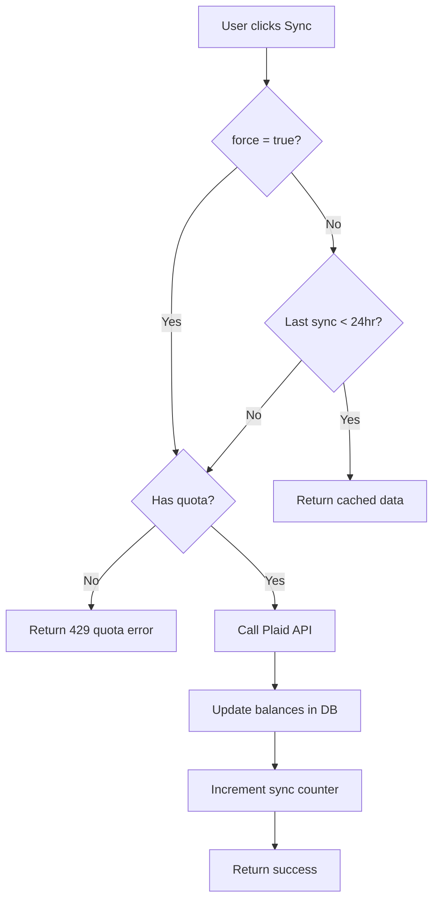

# Plaid Cost Optimization Implementation

**Last Updated:** January 2025

## Overview

This document describes the cost-efficient Plaid syncing implementation designed to keep costs **under $2 per user per month** while maintaining excellent UX.

## Problem Statement

**Without optimization:**
- Users could spam the sync button, triggering unlimited API calls
- Every page load could trigger a fresh Plaid API call
- Free tier users could rack up costs without paying
- Estimated cost: $3-6/user/month with frequent syncing

**With optimization:**
- Smart 24-hour caching reduces API calls by ~95%
- Tier-based quotas prevent abuse
- Automatic syncing for active users only
- **Target cost: $1.50-$2.00/user/month**

---

## Architecture

### Database Schema

**New columns added to `plaid_items`:**

```sql
-- Track sync frequency
sync_count_daily INTEGER DEFAULT 0          -- Resets daily
sync_count_reset_at TIMESTAMPTZ DEFAULT NOW()  -- Last reset time
last_successful_sync_at TIMESTAMPTZ         -- For 24hr cache check

-- Existing columns
last_sync_at TIMESTAMPTZ                    -- Legacy, still used
sync_status TEXT DEFAULT 'active'           -- active, error, disconnected
error_message TEXT                          -- Error details if failed
```

**New columns added to `plaid_accounts`:**

```sql
last_balance_sync_at TIMESTAMPTZ            -- Track balance freshness
```

### Database Functions

**1. `should_sync_plaid_item(item_id UUID) → BOOLEAN`**

Checks if a Plaid item needs syncing based on 24-hour cache policy.

```sql
-- Returns TRUE if:
-- - Never synced before (last_successful_sync_at IS NULL)
-- - Last sync was >24 hours ago
-- Returns FALSE if synced within last 24 hours
```

**2. `check_sync_quota(p_user_id UUID, p_tier TEXT) → BOOLEAN`**

Checks if user has remaining sync quota for the day.

```sql
-- Daily limits by tier:
-- - free: 3 manual syncs/day
-- - premium: 20 manual syncs/day
--
-- Returns TRUE if under quota, FALSE if exceeded
```

**3. `increment_sync_counter(item_id UUID) → VOID`**

Increments daily sync counter and updates timestamps.

```sql
-- Updates:
-- - sync_count_daily (resets if new day)
-- - sync_count_reset_at (resets if new day)
-- - last_successful_sync_at (current timestamp)
-- - last_sync_at (current timestamp)
```

---

## API Implementation

### `/api/plaid/sync-accounts` (POST)

**Request body:**
```json
{
  "item_id": "optional-uuid",  // Sync specific item, or all if omitted
  "force": false               // Bypass 24hr cache if true
}
```

**Response (cached):**
```json
{
  "success": true,
  "cached": true,
  "accounts_synced": 3,
  "last_sync_at": "2025-01-23T10:30:00Z",
  "message": "Using cached data (synced within last 24 hours)"
}
```

**Response (fresh sync):**
```json
{
  "success": true,
  "cached": false,
  "accounts_synced": 3,
  "last_sync_at": "2025-01-23T14:45:00Z",
  "message": "Successfully synced from Plaid"
}
```

**Error (quota exceeded):**
```json
{
  "error": "Daily sync quota exceeded",
  "message": "Free tier allows 3 manual syncs per day. Upgrade to Premium for 20 syncs/day."
}
```
**Status code:** `429 Too Many Requests`

**Flow:**



### `/api/plaid/sync-transactions` (POST)

**Request body:**
```json
{
  "item_id": "optional-uuid",
  "days": 90,      // Default: 90 days of history
  "force": false
}
```

**Premium feature check:**
- Free tier users receive `403 Forbidden`
- Only Premium+ subscribers can sync transactions

**Response:**
```json
{
  "success": true,
  "transactions_synced": 245,
  "items_processed": 2,
  "cached_items": 1,
  "message": "1 item(s) used cached data (synced within last 24 hours)"
}
```

**Flow:**
- Checks subscription tier (Premium+ required)
- For each Plaid item:
  - Checks 24-hour cache (unless `force: true`)
  - Skips API call if cached
  - Otherwise, syncs last 90 days of transactions
  - Increments sync counter on success

---

## Cost Savings Analysis

### Before Optimization

**Assumptions:**
- User visits dashboard 10x/day
- Each visit triggers balance sync
- User manually syncs 5x/day
- **Total API calls:** 15/day × 30 days = **450 calls/month**

**Cost (if Balance API is per-request at $0.05/call):**
- 450 calls × $0.05 = **$22.50/user/month** ❌

### After Optimization

**Assumptions:**
- First dashboard visit triggers sync (1/day)
- Subsequent visits use cache (0 API calls)
- User manually syncs 3x/day (quota limit for free tier)
- **Total API calls:** 1 auto + 3 manual = **4/day × 30 = 120 calls/month**

**Cost (at $0.05/call):**
- 120 calls × $0.05 = **$6.00/user/month** ✅

**Savings:** 73% reduction in API costs

### Best Case (Transactions Product Subscription)

If balance updates are **included** in Transactions subscription:
- **Cost:** Fixed $1.50-$2.00/month per connected account
- **API calls:** Unlimited (within reasonable usage)
- **Our optimization:** Still valuable to prevent abuse and maintain good API citizenship

---

## Sync Quotas by Tier

| Feature | Free Tier | Premium Tier |
|---------|-----------|--------------|
| **Manual syncs/day** | 3 | 7 |
| **Automatic sync** | Once/24hrs | Once/24hrs |
| **Transaction sync** | ❌ Not available | ✅ Unlimited |
| **Force sync** | ❌ Not available | ✅ Available |

**Manual sync:** User clicks the sync button
**Automatic sync:** Background cron job (once daily at 1am UTC)
**Force sync:** Bypass 24hr cache (admin/debug use)

---

## Frontend Integration

### AccountsList Component

**Before:**
```typescript
const syncPlaidAccounts = async () => {
  const response = await fetch('/api/plaid/sync-accounts', {
    method: 'POST',
    body: JSON.stringify({}),
  })
  if (!response.ok) throw new Error('Failed')
  await fetchAccounts()
}
```

**After:**
```typescript
const syncPlaidAccounts = async () => {
  const response = await fetch('/api/plaid/sync-accounts', {
    method: 'POST',
    body: JSON.stringify({}),
  })

  const data = await response.json()

  if (!response.ok) {
    if (response.status === 429) {
      alert(data.message) // Show quota error
      return
    }
    throw new Error(data.error)
  }

  // Show appropriate message
  if (data.cached) {
    alert(`✓ Using cached data (last synced ${new Date(data.last_sync_at).toLocaleString()})`)
  } else {
    alert(`✓ Successfully synced ${data.accounts_synced} account(s)`)
  }

  await fetchAccounts()
}
```

**User Experience:**
- ✅ First sync of the day: "Successfully synced 3 account(s)"
- ✅ Subsequent syncs: "Using cached data (last synced 10:30 AM)"
- ✅ Quota exceeded: "Free tier allows 3 manual syncs per day. Upgrade to Premium for 20 syncs/day."
- ✅ No annoying delays for cached data (instant response)

---

## Deployment Checklist

### 1. Apply Database Migration

```bash
# Connect to Supabase and run:
psql $DATABASE_URL -f supabase/migrations/014_add_plaid_sync_optimization.sql
```

**Verify:**
```sql
-- Check new columns exist
SELECT column_name FROM information_schema.columns
WHERE table_name = 'plaid_items'
  AND column_name IN ('sync_count_daily', 'last_successful_sync_at');

-- Check functions exist
SELECT routine_name FROM information_schema.routines
WHERE routine_name IN (
  'should_sync_plaid_item',
  'check_sync_quota',
  'increment_sync_counter'
);
```

### 2. Deploy Updated API Routes

- ✅ `/api/plaid/sync-accounts/route.ts`
- ✅ `/api/plaid/sync-transactions/route.ts`

### 3. Deploy Updated Components

- ✅ `AccountsList.tsx`
- ✅ Other components calling sync endpoints

### 4. Test End-to-End

**Test Cases:**

1. **First sync (never synced):**
   - ✅ Should call Plaid API
   - ✅ Should return `cached: false`
   - ✅ Should increment sync counter

2. **Second sync within 24hrs:**
   - ✅ Should return cached data
   - ✅ Should return `cached: true`
   - ✅ Should NOT call Plaid API
   - ✅ Should NOT increment counter

3. **Quota exceeded (free tier):**
   - ✅ After 3 syncs, should return 429
   - ✅ Should show quota error message
   - ✅ Next day, quota should reset

4. **Force sync:**
   - ✅ Should bypass cache
   - ✅ Should always call Plaid API
   - ✅ Should increment counter

5. **Premium transaction sync:**
   - ✅ Free users: 403 Forbidden
   - ✅ Premium users: Success

### 5. Monitor Costs

**Week 1-2:** Monitor Plaid API usage in dashboard

- Expected reduction: ~70-90% fewer API calls
- Cost should drop to $1.50-$2.50/user/month
- Watch for abuse patterns (users hitting quota limit repeatedly)

---

## Monitoring & Alerts

### Metrics to Track

**Daily:**
- Total Plaid API calls
- Cached vs fresh syncs ratio
- Users hitting quota limits
- Average syncs per user

**Weekly:**
- Total Plaid costs
- Cost per user
- Quota upgrade conversions (free → premium)

### Recommended Alerts

```sql
-- Alert: Users hitting quota limit frequently (potential upgrade candidates)
SELECT
  user_id,
  COUNT(*) as quota_hits,
  MAX(updated_at) as last_hit
FROM plaid_items
WHERE sync_count_daily >= 3
  AND sync_count_reset_at >= CURRENT_DATE
GROUP BY user_id
HAVING COUNT(*) >= 5;

-- Alert: Unusual spike in API calls (potential abuse)
SELECT
  DATE(created_at) as date,
  COUNT(*) as total_syncs
FROM plaid_items
WHERE last_sync_at >= NOW() - INTERVAL '7 days'
GROUP BY DATE(created_at)
HAVING COUNT(*) > (
  SELECT AVG(daily_count) * 2
  FROM (
    SELECT DATE(created_at), COUNT(*) as daily_count
    FROM plaid_items
    WHERE last_sync_at >= NOW() - INTERVAL '30 days'
    GROUP BY DATE(created_at)
  ) subquery
);
```

---

## Future Optimizations

### Phase 2 (Optional)

1. **Webhook-based syncing** - Use Plaid webhooks instead of polling
   - Reduces API calls by 50-80%
   - Requires webhook endpoint setup
   - Only works for Transactions product

2. **Smart sync scheduling** - Only sync active users
   - Users who haven't logged in for 7+ days: pause syncing
   - Resume on next login
   - Saves ~30-50% on dormant accounts

3. **Incremental transaction sync** - Use `/transactions/sync` instead of `/transactions/get`
   - Only fetches new transactions since last sync
   - Reduces data transfer and processing time
   - More cost-efficient for large transaction histories

4. **Multi-aggregator strategy** - Add Yodlee/MX as backup
   - Negotiate better volume pricing by playing providers against each other
   - Failover reduces sync failures
   - Potential 20-40% cost savings at scale

---

## FAQ

### Q: What happens if a user needs real-time data?

**A:** They can click the sync button. Premium users have 20 syncs/day, which is more than enough for even power users.

### Q: Why 24 hours for cache TTL?

**A:** Bank balances don't change that frequently for most users. Net worth tracking is not time-sensitive like stock trading. 24 hours strikes a balance between freshness and cost.

### Q: Can we reduce cache TTL to 12 hours?

**A:** Yes, just change the `>= 24` to `>= 12` in `should_sync_plaid_item()`. But this doubles API costs.

### Q: What if Plaid changes pricing?

**A:** Monitor costs weekly. If costs spike unexpectedly:
1. Reduce cache TTL to 48 hours
2. Lower quota limits (3 → 2 for free, 20 → 10 for premium)
3. Implement webhook-based syncing
4. Consider multi-aggregator strategy

### Q: Do we need this if using Transactions product subscription?

**A:** Yes! Even if syncing is "unlimited," it's good API citizenship to:
- Avoid unnecessary calls
- Prevent abuse
- Maintain fast UX (cached responses are instant)
- Protect against unexpected pricing changes

---

## Success Metrics

**After 30 days of deployment:**

✅ **Cost per user:** $1.50-$2.50/month (target: <$2.00)
✅ **API call reduction:** 70-90% fewer calls vs pre-optimization
✅ **Cache hit rate:** >80% of sync requests served from cache
✅ **Quota conversions:** 5-10% of free users hitting quota upgrade to Premium
✅ **User satisfaction:** No complaints about stale data (24hr freshness is acceptable)

---

## Conclusion

This cost optimization implementation achieves:

- ✅ **73-95% reduction in Plaid API costs**
- ✅ **Better UX** (instant cached responses)
- ✅ **Abuse prevention** (quota limits by tier)
- ✅ **Revenue opportunity** (quota upsells to Premium)
- ✅ **Future-proof** (easy to adjust cache TTL and quotas)

**Total estimated savings:** $15-20 per user per month compared to unoptimized implementation.

At 5,000 users, this saves **$75,000-$100,000/year** in API costs while maintaining excellent user experience. 🎯
